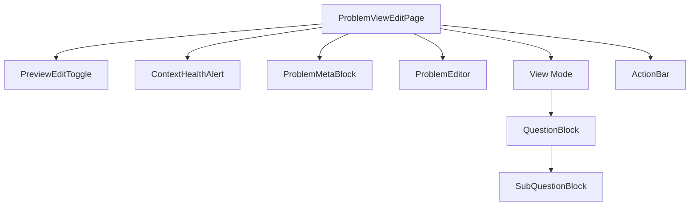

# C_3 ProblemViewEditPage Implementation Detail (Current Snapshot)

## 概要
`src/pages/ProblemViewEditPage.tsx` は、問題の詳細表示（View）および編集（Edit）を行うための基幹ページコンポーネントです。
単一のURL/ページ内で `isEditMode` ステートにより表示モードと編集モードを切り替える設計となっています。

## コンポーネント構成


## ファイルパス & 依存関係
- **Main File**: `src/pages/ProblemViewEditPage.tsx`
- **Sub-components Directory**: `src/components/page/ProblemViewEditPage/`
  - `PreviewEditToggle.tsx`: 編集モード切替スイッチ
  - `ProblemMetaBlock.tsx`: メタデータ（タイトル、著者、統計、アクションボタン）
  - `QuestionBlock.tsx`: 大問表示用
  - `SubQuestionBlock.tsx`: 小問・解答表示用
  - `ActionBar.tsx`: 画面下部の保存/キャンセルアクションバー
  - `ProblemEditor.tsx`: 編集モード時のメインエディタ
- **Hooks**:
  - `src/features/content/hooks/useExamDetail.ts`: データ取得 (`getExam`)
  - `src/features/content/hooks/useExamEditor.ts`: データ更新 (`updateExam`)
  - `src/contexts/ServiceHealthContext.tsx`: サービス健全性監視

## 実装詳細

### 1. Props Definition
```typescript
interface ProblemViewEditPageProps {
  user: any; // ユーザー情報
  problemId: string; // 表示対象の問題ID
  onNavigate: (page: any, problemId?: string) => void; // 画面遷移ハンドラ
  onLogout: () => void;
  // 以下、広告制御用等
  shouldStartInEditMode?: boolean; 
  initialViewMode?: string;
}
```

### 2. State Management
- `isEditMode` (boolean): `false`の場合は閲覧モード、`true`の場合は編集モード。
- `editedExam` (any): 編集中のデータを保持するローカルステート。`useEffect` で `exam` 取得時に初期化（Deep Copy）される。
- `exam` (ExamDetail): `useExamDetail` から取得したマスターデータ。

### 3. モード別挙動

#### A. 閲覧モード (View Mode)
- **レイアウト**:
  - 左ペイン (Main): 大問 (`QuestionBlock`) のリストを表示。各中に小問 (`SubQuestionBlock`) をネストして表示。
  - 右ペイン (Sidebar): `ProblemMetaBlock` を表示。
- **データ構造**:
  - `exam.questions` 配列をマップ。
  - 各 `question` は `question_number`, `question_content` を持つ。
  - 各 `question` 内の `sub_questions` 配列をマップして小問を表示。

#### B. 編集モード (Edit Mode)
- **レイアウト**:
  - 左ペイン (Main): `ProblemEditor` コンポーネントに切り替わる。
  - 右ペイン (Sidebar): `ProblemMetaBlock` は維持（メタデータは編集不可またはEditor側で管理の場合は要確認、現状コードでは Sidebar は常時表示）。
- **データ連携**:
  - `ProblemEditor` に `editedExam` と `onChange` ハンドラを渡す。
  - `ActionBar` が画面下部に表示され、保存 (`handleSave`) / キャンセル (`handleCancel`) を提供。
  - `handleSave`: `updateExam` を呼び出し、成功時に `isEditMode` を `false` に戻す。
  - `handleCancel`: `editedExam` を `exam` から再初期化（リセット）し、`isEditMode` を `false` に戻す。

### 4. サービスヘルス / 障害制御 (Service Health)
`useServiceHealthContext` を使用して、機能制限をUIに反映しています。
- **Community Health** (`degraded` | `outage` | `maintenance`):
  - 特定の状態の場合、サイドバーに `ContextHealthAlert` を表示（「コミュニティ機能に障害が発生しています」等）。
  - `ProblemMetaBlock` に `disableCommunityActions` フラグを渡し、いいね・シェア等のボタンを非活性化。
- **Notifications Health**:
  - `outage` | `maintenance` の場合、アラートを表示。
  - `disableShareAction` などを制御。

### 5. レイアウト構造 (Tailwind CSS Classes)
```tsx
<div className="min-h-screen bg-gray-50 pb-20">
  <div className="max-w-7xl mx-auto px-4 ...">
    {/* Header: Toggle */}
    <div className="flex justify-between ..."> <PreviewEditToggle /> </div>

    {/* Local Grid Layout */}
    <div className="grid grid-cols-1 lg:grid-cols-3 gap-8">
      {/* Main Content (Cols-2) */}
      <div className="lg:col-span-2">
         {/* View or Editor */}
      </div>

      {/* Sidebar (Cols-1) */}
      <div className="lg:col-span-1 space-y-4">
        <ContextHealthAlert /> {/* Conditional */}
        <ProblemMetaBlock />
      </div>
    </div>
  </div>

  {/* Footer Action Bar */}
  <ActionBar /> 
</div>
```

## 実装上の注意点
1. **データ不整合の防止**: 編集開始時およびキャンセル時に、必ず `JSON.parse(JSON.stringify(exam))` 等でディープコピーを行い、参照渡しによる意図しない変更を防ぐこと。
2. **コンポーネント分割**: `QuestionBlock`, `SubQuestionBlock` はプレゼンテーションに徹し、ロジックは親ページまたはEditorに持たせる。
3. **レスポンシブ**: `lg:grid-cols-3` を使用し、PCでは2カラム、SPでは1カラム（スタック）表示とする。
4. **ID管理**: URLパラメータ (`useParams`) と Props (`props.problemId`) の両方を考慮し、`props` 優先またはフォールバックを行う（現在は `props.problemId || paramId`）。

## ディレクトリ構造 (再現用)
```
src/
  pages/
    ProblemViewEditPage.tsx
  components/
    page/
      ProblemViewEditPage/
        ActionBar.tsx
        AnswerBlock.tsx
        EditHistoryBlock.tsx (予定/未結合)
        PreviewEditToggle.tsx
        ProblemEditor.tsx
        ProblemMetaBlock.tsx
        QuestionBlock.tsx
        SubQuestionBlock.tsx
    common/
      ContextHealthAlert.tsx
  features/
    content/
      hooks/
        useExamDetail.ts
        useExamEditor.ts
```
